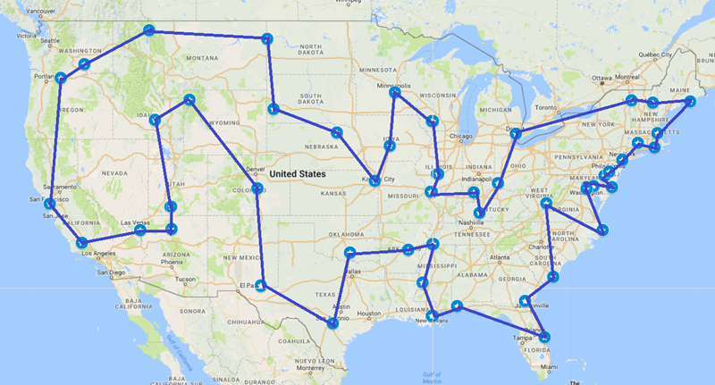
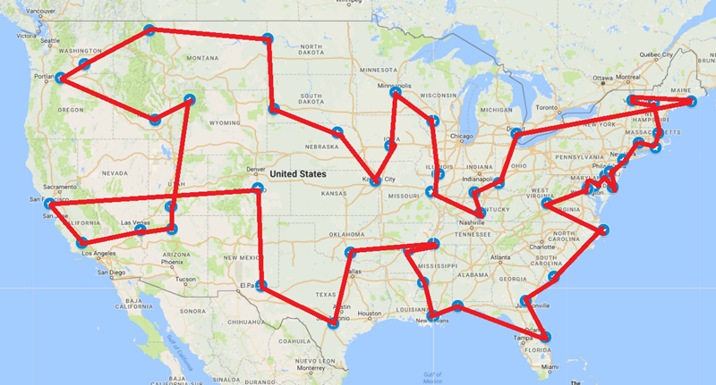
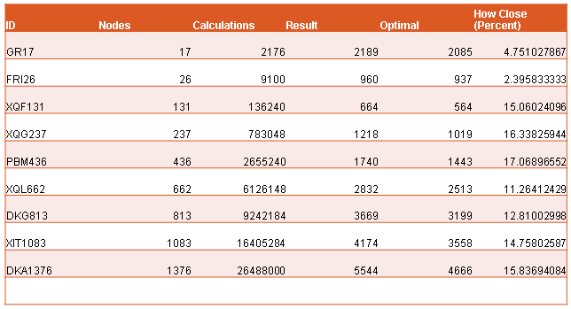
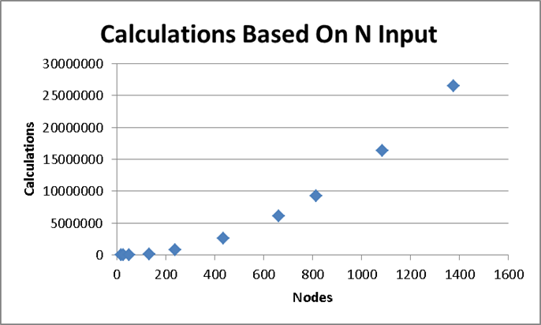
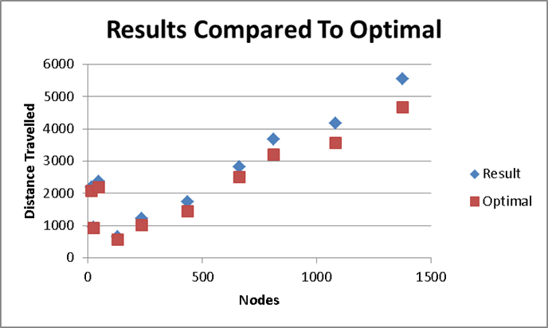

| [Main](README.md) | [Experience](Experience.md)| [Course Work](Courses.md)| [Technical Documents](Technical.md) | [Code](Code.md) | Project

# Senior Project 2017

## Hamiltonian Cycle Algorithm

For my senior project I examined the properties of Weighted Connected Undirected (WCU) Graphs and proved a new property that allowed me to utilize it in Hamiltonian Cycle algorithms. My work defined an Optimally Connected Pair (OCP) as a set of two nodes within a WCU Graph that are "closer" to each other than any other nodes: that is, they share a smallest edge. I went on to mathematically prove that every WCU graph contains at least one OCP.

## Proof

My mathematical proof uses a proof by contradiction to prove my claim by examining a WCU graph that does not contain an OCP. This proof allows the property to be used in algorithms, guaranteeing the algorithm will halt on run time with a deterministic solution.

My entire proof can be found [here](ocp.pdf).

## Algorithm

I developed an algorithm around the property to produce a heuristic solution to the data set provided. Based on n input, the algorithm has a worst case runtime of n^3, with a best case of n. For memory, the algorithm uses n^2 memory. 

## Results

When considering the runtime, the algorithm produces very accurate results when compared to the optimal solution.

Considering the famous 50 USA Landmarks data set:

Figure 1: Optimal Solution

Figure 2: Algorithm Solution

Comparing Figure 1 and Figure 2 yields an interesting view into how the algorithm works. It has some properties of a Greedy Algorithm, as seen in the north western region, while also having very high accuracy where the Greedy Algorithm would fail.

In addition to the 50 USA Landmarks data set, I also examined the results of other data sets.

The amount of calculations needed in each data set closely match the theoretical needs.

The algorithm produces outstanding results when comparing many different data sets of different sizes.

## Presentation

In addition, I presented my findings to a group of my professors and peers. I was responsible for explaining the idea to a technical audience and defending my work against seasoned computer scientists.

My presentation can be found [here](ocppdf.pdf).
