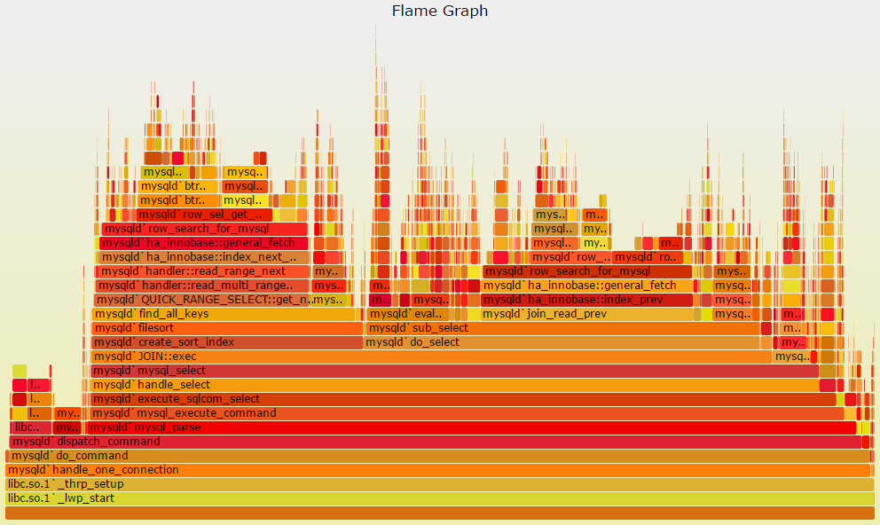

| Description | [Use Cases](UseCases.md)| [Results](Results.md) | [Setup](Setup.md) | [Run](Run.md) | [Evaluation](Evaluation.md)

# Description

Flame graphs allow you to easily visualize different components in currently running processes of profiled software. The most common use is to help graph codepaths using CPU cycles, however with proper flagging and familiarity with the tool users can track memory usage, disk usage, networks, file system access, IO streams, CPU events such as cache misses, and latency. Flame Graphs is extremely versatile to the advanced user, and supports many languages.

# Use Cases

## Who are Flame Graphs for?

Flame graphs are for you if you're doing something at scale - website, server, program, whatever. If something is done at a large enough scale, the time spent optimizing and finding inefficiencies will pay dividends in the future at scale too. A program would also benefit from flame graph profiling it it simply is very computationally intensive - even if it isn't done in a typical distributed web based scaling fashion.

### How complete should your code be?

Flame graphs are something you use after you've written the code and have it running. Flame Graphs are not very helpful during design, development, and testing.  By using profilers and tools like Flame Graphs you can develop with the philosophy "code now, optimize later". You never truly know what is actually an optimization during development anyways. Another benefit to this philosophy is when optimization is not a priority during development and design, "clever" tricks to "speed-up" the program can stay out of the code (they often do little besides confuse future devs anyways).

### Environment - Large Infrastructure

#### How much are companies spending on infrastructure?

Snap, Inc (Snapchat parent company) spends [$1 billion USD](https://www.fool.com/investing/2017/02/09/snap-inc-is-also-spending-1-billion-with-amazon-aw.aspx) annually on AWS infrastructure

Salesforce spends [$400 million USD](http://fortune.com/2016/05/25/salesforce-inks-major-aws-deal/) annually on AWS infrastructure.

Other larger cloud users like Google, Amazon, and Netflix do not publish statistics on this.

Basically, infrastructure, especially cloud infrastructure is not cheap since it effectively eliminates hardware and IT staff costs. Companies spend a lot on infrastructure, and small optimizations can have resounding effects. Because optimizations = faster code = lighter server loads = smaller/fewer server instances.

If a developer, with the right tools, can cause a 1% increase in efficiency, they can potentially save the company $1 million a year. Not only will the developer probably see a nice bonus that year, but a change such as this will have a positive effect on the company's stock prices (which the developer probably has some of) - win win scenario here.

You might be thinking that a 1% efficiency increase across the board sounds far fetched though. And maybe you're right. Let's imagine there is a library (internal or external) used throughout the company on several services. A 10% optimization of this library could easily create a cascading effect across the organization.

In many unoptimized and unprofiled services, there are likely many low hanging optimization fruits giving 10%+ efficiency gains that likely take less than an hour of the developers time to discover and fix.

#### So again, why profile and use flame graphs?

After the long winded rant about infrastructure costs and optimization, you should profile and use flame graphs because it's easy and the results (savings) are worthwhile and significant. Something that takes less than an hour can have implications far beyond the cost of time spent.

### Program Types

If you have a web server or service, batch processing system, speed critical system, or anything that has a lot of CPU time, you should try Flame Graph Profiling.

### Code Patterns

If much of your program's work is done by external libraries, it's worth ensuring you're using them efficiently. It's also not hard to imagine that a library might have an inefficiency that hasn't been revealed until now because the library is being used at a scale not before experienced. If this is the case, find the libraries inefficiency, fix it, and submit a pull request.

#### Common Examples

Some libraries have common patterns where they recommend you use them in a specific way, these include JSON parsers, serialization libraries, string functions, and network/communication libraries.

A frequent pattern that appears in inefficiencies is not treating a library object as a resource. Let's suppose you need to get some data, do some work on it, then send the result over the network. The network communication here requires serializing the data. A frequent but inefficient pattern is to construct a new serializer object everytime to accomplish this. You can make many serializers across instances, threads, and method calls that do mostly the same thing. A better much more efficient solution is to make a static serializer resource.

### Language

There is no catch-all tool for flame graphs yet. There is typically one tool for one (or a small handful of) language(s). Some languages are easier to profile than others.

The **easiest languages** at this time to profile are:

* Anything on the JVM
	* Java
	* Scala
	* Clojure
	* Groovy
	* Kotlin
	* JRuby
	* Jython
* Go
* PHP
* Python
* NodeJS
* Haskell

The languages with the seemingly **best tools** as of now are Go (tool developed by Uber) and Java (tool developed by Netflix).  

## Who are Flame Graphs not for?

### Program Types
GUI/Frontend programs that are not widely used and where most of the time is spent waiting on user input.

Small services - optimization has a smaller return when not done at scale. 

### Costs
If running your web service costs an inconsequential annual amount, it's likely not worth your time to profile the service for inefficiencies.

## How are flame graphs useful to software engineers?

### How should a developer use flame graphs?

1. State the main purpose of your application
	* For example, let's imagine we are the Google Maps backend. We want to do receive some data (address waypoints for instance), do some expensive processing (I imagine routing is non-trivial), and return the route over the network.
2. From your main purpose, make an educated guess about where you expect the majority of CPU time should be spent. This should usually be your application's purpose, not additional serialization or network tasks.
	* For our Google Maps example, we'd probably want 75% or more of our CPU time spent on graph route processing - this seems much more expensive than network communication.
3. Profile your application using your flame graph tool of choice.
	* Different tool for each language so far
4. View the results.
	* Were your assumptions correct? Or are you spending most of your time constructing objects that could be static resources?
	* Also compare different operations. For example, do you spend more time looking up an address than finding a route there? Also, do you spend more time constructing an object than you do using it (especially true of library generated objects)?

### Reading Flame Graphs

These are actually quite simple to read.

The above image shows MySQL codepaths consuming CPU cycles. The x-axis represents stack profile population (percentage of CPU time for that method), and the y-axis represents stack depth. Each section is a stack frame, with wider sections representing stacks that are present more often. At the top, the edges represent what is on CPU, and beneath them are its ancestors (exactly like a program stack trace). It is important to note that color is not signifigant to the interpretation of the graph, and neither is the sorting order (they are sorted alphabetically). This means that the left to right order of methods does not imply execution order.

This example is from [Brendan Gregg's website](http://www.brendangregg.com/index.html), the creator of Flame Graphs.

## Test Systems

### Good canidates we won't be profiling

#### Open-Source Distributed Systems

These would all be great canidates for profiling - they have streaming data, perform pretty hefty computations, and are done at scale. Unfortunately, these all seem to be C++ code. At the present time, C++ code is not easy to profile and generate flame graphs for. It has been done, but the tooling does not seem complete.

The systems we could have profiled here include:

* [SETI@home](http://setiathome.ssl.berkeley.edu/)
* [Folding@home](https://folding.stanford.edu/)
* [Bitcoin](https://bitcoin.org/en/)

### Systems we can easily profile

#### Program Choosing Criteria

The obvious candidates are any web company's server backend, but those are not open source, so we are targeting anything that meets the follow criteria:

* Easy to profile language
* Scalable services
	* Web servers and anything with a continuous data stream
* Continuously running programs
	* We can get more data points to generate the flame graph
	* Even if it is a GUI program, for the purposes of education it will work nicely

#### Program Candidate List

Note that we will not be profiling all of these, but rather those that are easiest to set up and build from source.

* [Minecraft servers](https://hub.spigotmc.org/jenkins/job/BuildTools/)
	* Java
	* Program at scale
	* Continuously running service
	* Streaming data input
* [Docker](https://www.docker.com/)
	* Go
	* Program at scale (with its userbase)
	* Continuously Running
* [iTrace](https://github.com/YsuSERESL/iTrace)
	* Java
	* Continuously Running
	* Program at scale (eventually)
	* Could also include profiling Eclipse itself
* [NASA World Wind](https://github.com/NASAWorldWind/WorldWindJava)
	* Java
	* Continuously Running
	* Will give us interesting GUI oriented results
* [Atom](https://github.com/atom/atom)
	* NodeJS
	* Scale through user base
* [Eclipse Che](https://github.com/eclipse/che/)
	* Java
	* Can be done at scale since it is a web server
* [Google TensorFlow ML Models](https://github.com/tensorflow/models)
	* Python
	* Not continuous running
	* Scale through expensive computations
* [Syncthing](https://github.com/syncthing/syncthing/)
	* Go
	* Scalable by syncing more files
* [Meld](https://github.com/GNOME/meld)
	* Python
	* Optimizations will increase program speed and developer productivity (scalable)
	* Large files with significant diff (scale)
