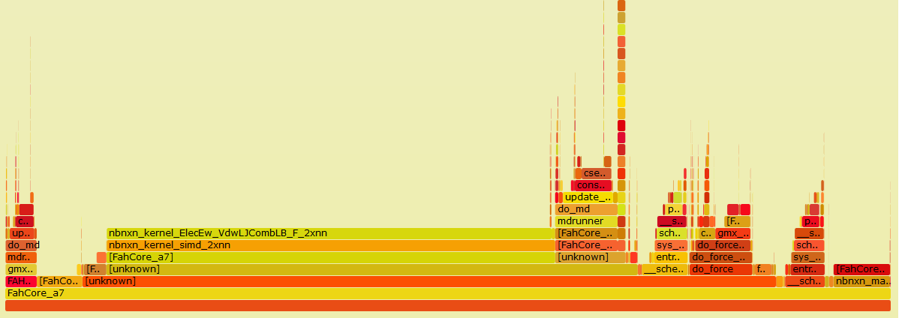
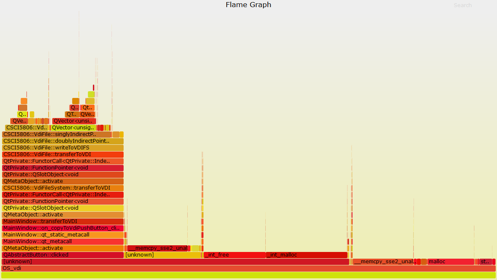
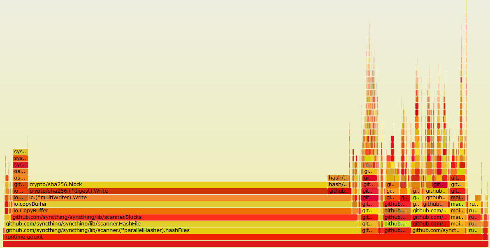
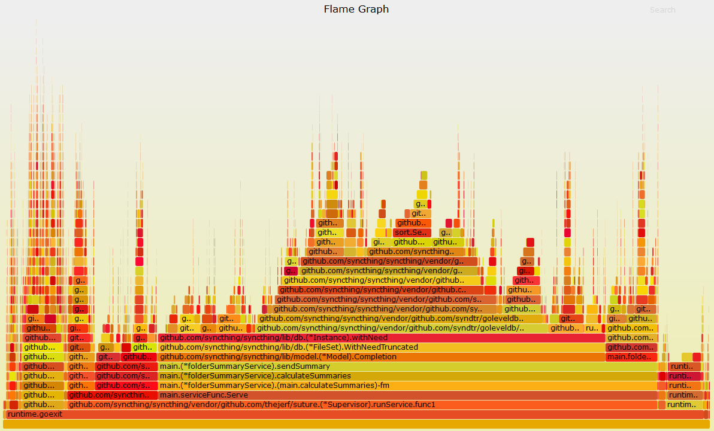

| [Description](README.md) | [Use Cases](UseCases.md)| Results | [Setup](Setup.md) | [Run](Run.md) | [Evaluation](Evaluation.md)

# Results

## Folding@HOME

"Folding@home (FAH or F@h) is a distributed computing project for disease research that simulates protein folding, computational drug design, and other types of molecular dynamics." - [Wikipedia](https://en.wikipedia.org/wiki/Folding@home)

Thousands of people have Folding@home installed on their PCs to try and find cures to many of humanity's biggest problems.

Folding@home is written in C++, but I was not able to acquire the source, so this is ran on the precompiled distributed binaries - hence the large number of unknowns in the flame graph.

There are some interesting results in this flame graph (click to enlarge)
 [](./Flame Graphs/FoldingAtHomeCore.svg).

50.63% of the execution time was spent in a library called [Gromacs](https://redmine.gromacs.org/) which is used to simulate Newtonian physics for millions of particales in macro biomolecules, especially protiens.

Great, we pass the santity check, we are spending the majority of our time doing something that sounds like our main task. The question is what are we doing with the remaining 50% of the time? This is a question left for the developers of this project with access to the source where they can create debug symbols and reduce the number of unknown stack frames.

## VDI ext2 file utility

This project was for YSU's CSCI 5806 Operating Systems class. This program is designed to take a VirtualBox VDI file containing a virtual hard drive already formatted in ext2 and provides the ability to read and write files from the local file system to this VDI file.

This program is written in C++ using Qt libraries and C++ fstream for file I/O. The program was written by [Tyler Hovanec](http://github.com/tbhova/) and [Andy Morgan](http://github.com/asmorgan24/).

### Expectations

We knew the program was quite slow. There was plenty of headway for optimizations here. When reading or writing a large file to/from the VDI 100% of a single core will be occupied during the operation. We are not even limited by disk access speed here when using an SSD and moderately slow dual core.

I expected that the majority of CPU time would be spent in the fstream libraries since data is read and written byte by byte to and from the file with the buffer flushed after every byte.

### Results

After compiling the program with ```-fno-omit-frame-pointer```, we were able to profile the program using our [C++ Flame Graph Instructions](C++RunningInstructions.md).

The initial results can be viewed in this flame graph (click to enlarge).

[](Flame Graphs/OS_Project.svg).

This graph is generated while writing 1.6GB to the VDI file. Useful work is done for all methods above the QAbstractButton::clicked method. Once the "Transfer to VDI" button is clicked the transfer code runs. The red flag here is that code only runs for 24.58% of the program's CPU time. This means we're doing mean useless work (in this case memory allocation and deallocation) for roughly 75% of the time.

**In short, 25% of the CPU time is useful. 75% of the CPU time is needless memory manegement.**

It turns out we were wrong - most CPU time is not spent interacting with the files but rather creating memory to interact with the files. To optimize this, all we need to do is look for code where we need a much of dynamically allcoated memory.

### The fix

After reading through the code I found one section that was especially to blame for efficient memory use.

The flame graph after the fix can be seen here (click to enlarge).

[](Flame Graphs/OS_Project_Optimized.svg).

Now our useful work has increased from **25% to 91.11%** - nearly a threefold increase!

Here is [the commit creating this fix](https://github.com/tbhova/VDI-ext2-File-Read-Write-Utility/commit/f366fd0400e84831c783617d01afc4b5d4b5400b). The fix is nearly a one line change if we ignore the deletions.

### The problem

We were doing this operation in a for loop:

```
string = string + "new data"
```

This generates and deletes a string with a length equal to the loops iteration. I.E. tons of expensive memory allocation and deallocation.


## Syncthing

Syncthing is a consumer file synchronization tool for consumers that uses a propriety distributed peer-to-peer block protocol to sync data between PCs. Essentially, Syncthing keeps folders you choose up to date on an arbitrary number of PCs without the use of a central sync server.

**Syncthing's git:** [https://github.com/syncthing/syncthing/](https://github.com/syncthing/syncthing/)

**Syncthing's website:** [http://syncthing.net/](http://syncthing.net/)

Syncthing is written in Go and these results were created with Uber's go-torch tool. Syncthing's developer team seems to be quite good and organized, and they actually already had Go's pprof profiling tool enabled, all I had to do was create a bash variable with the address and port I wanted the profiler to use.

### Profiling Adding a Sync Directory

When adding a folder to Syncthing the first thing it must do is create a SHA256 hash of every file in the directory to track changes. This is an inheritently CPU intensive task. The results of this are included in the the scan new folder flame graph below (click to enlarge).

[](./Flame Graphs/syncthingScanFolder.svg)

You can see that the majority of CPU time is spent in Go's SHA256 library. The questions here for Syncthing developers are can anything outside the hash function be optimized and is Go's SHA256 implementation efficient?

### Profiling Syncthing's Sync Operation

I wasn't really sure what to expect here for CPU time - maybe encryption, creating blocks, state synchonization between clients, etc.

As we can see in the sync folder flame graph below, the majority of time is spent generating summaries. These summaries are likely used for the percentage complete and state synchonization between clients.

Click to enlarge.

[](./Flame Graphs/syncthingSyncFolder.svg)
